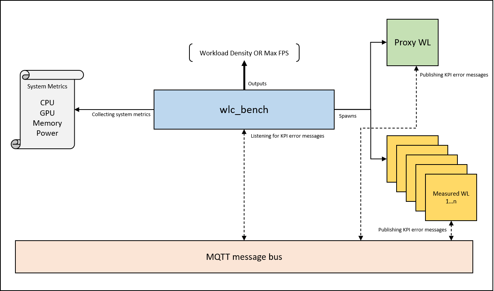

# wlc_bench

WLC (workload consolidation) framework for benchmarking and WL density profiling

The overall idea of how wlc_bench fits into our various platform benchmarking efforts 
is documented in this [Wiki](https://wiki.ith.intel.com/display/iotgsysarch/IOTG+System+Architecture+Home)




# General guidelines for new features

Please refer to CONTRIBUTING.md

# Overview

WLC benchmarking and density profiling framework. Instantiates multiple instances 
of workload under test and determines WLC density. Uses MQTT to listen to messages
from workloads under test

# Pre-Requisites

1. Install `mosquitto` MQTT broker
   `sudo apt update -y && sudo apt install mosquitto mosquitto-clients -y`
   
   `sudo systemctl status mosquitto` should show `running`
   
2. Your choice of workload-under-test
   
   `wlc_bench` has tested proxy HMI WL - `synbench`
   
   To instantiate `synbench`:
   
   - Clone, Build and Install `synbench` - [synbench](https://github.com/intel-innersource/drivers.gpu.virtualization.synbench/tree/hmi_proxy)
   
        **Note**: `synbench` needs Paho MQTT client libraries to be installed
   
        `sudo apt install openssl libssl-dev && git clone https://github.com/eclipse/paho.mqtt.c.git 
                && cd paho.mqtt.c && make && sudo make install`
   
   - Continue to build/run `synbench` (switch to `hmi_proxy` branch)
   
        **Note**: As part of the new timing code, please set the follow param in `params.txt` to 0
   
       `0           // KPI General: exit on kpi failure (1 = exit, 0 = don't exit)`
   
        **Above step is very important for synbench to run without exiting when errors occur. `synbench` is stopped
        via `wlc_bench` which handles the errors**
                
3. OS tested: Ubuntu 16, 18, 21, Tested using Python3.8

4. Python 3.8, Python PIP3

**Note**: If integrating new WL into `wlc_bench`, make sure your WL is publishing KPI related messages
on below mentioned MQTT channels. MQTT is the message bus of choice currently

# Install

1. `git clone <this repo>`
2. `cd wlc_bench`
3. `pip3 install -r requirements.txt`

**Note**: Please install python requirements using `requirements.txt` so that the right versions are installed

# Multiple Independent Display Support

Default configuration assumes single monitor setup on your target platform. Certain RBHE use cases need
a multiple monitor setup and we have enabled these use cases via `sway` compositor and `wlc_bench`

More details, setup instructions in this [Wiki](https://github.com/intel-innersource/frameworks.benchmarking.edge-systems.wlc-bench/wiki/RBHE-Multi-Display-Setup)

If multi monitor setup is not needed, above configuration is not required  

# Configuration file

Currently wlc_bench supports a single mode `breakpoint_serial`. 

This mode helps run multiple instances of the workload serially and 
helps determine max density i.e max number of workloads that can be run ona given platform

It can also print maximum FPS of a single workload. More details in section below

The file defines two types of workload:

1. Proxy WL - Typically one instance of this is run. Ex: on screen synbench instance
2. Conglomerate Measured WL -  Typically `m x n` instances of these are run where m = # of rounds of a particular grouped
   profile you want to run. n = # of times a particular workload inside that profile 

Each workload has a monitoring window called `kpi_window` in the yml file which indicates how long in seconds
to monitor each workload for KPI errors on the message bus before spawning a new workload

There is a common param called `settling_time` in the yml file which indicates the time in seconds given to a 
workload to settle down before we begin capturing/measuring KPIs

The framework helps determine how many workloads can be spawned while 
maintaining the KPIs of the workloads under test

## Env variables

Set all env variables that a workload (e.g. synbench) needs in the `env_vars` key in the YML file. If none,
keep list empty. `env_vars: []`

```
Ex: env_vars: [ DESTDIR=/home/synbench, OTHERVAR=othervalue]
```

## Init command, Start command, Stop command

The configuration file supports 3 types of commands for a workload:

All 3 commands supports following three formats:
1. Single shell command. `python run.py`
2. Piped commands `python run1.py && python run2.py`
3. Path to a shell script containing multiple commands. `./somescript.sh`

1. `init_cmd`: Any initialization commands to be done before workload begins
2. `start_cmd`: Fully qualified command to start a workload 
3. `stop_cmd`: Any commands needed to stop the workload (this is used mainly for dockerized workloads,
    workloads started natively can keep this as `null`)

```
    {
        wl: synbench,
        profile_name: low,
        init_cmd: /home/sk/run_synbench_init.sh OR any other shell command,
        start_cmd: /home/synbench/synbench /home/params/low.txt,
        stop_cmd: null,
        instances: 1,
        kpi_window: 20
    }
```

## Workload definitions

### Proxy workload

Define all your static workloads inside the `wl_list: ` parameter one after the other

```
proxy_wl:
    wl_list:
      [
        {
          wl: synbench,
          profile_name: low,
          init_cmd: null,
          start_cmd: /home/synbench/synbench /home/params/low.txt,
          stop_cmd: null,
          instances: 1,
          kpi_window: 20
        },
        {
          wl: ai,
          profile_name: low,
          init_cmd: null,
          start_cmd: /home/ai/ai /home/params/low.txt,
          stop_cmd: null,
          instances: 1,
          kpi_window: 20
        }
      ]
```

### Conglomerate measured workloads

Bench now supports defining workload profiles for measured workloads. This means you can define a class of workloads
which you want to use for your measurements, WL density calculations.

Ex: Let's say we want to define a `indu_cmc_hmi_high` profile where we want to understand how much residual AI is left when
we start 2 of AI-low and 3 of AI-mid in the measured section.

An example configuration will look like so:

```
measured_wl:
  indu_cmc_hmi_high:

      calculate: wkld_density
      instances: 1
      wl_list:
      [
        {
          wl: ai-low,
          profile_name: low,
          init_cmd: null,
          start_cmd: /home//ai-low /home/params/low.txt,
          stop_cmd: null,
          instances: 2,
          kpi_window: 20
        },
        {
          wl: ai-mid,
          profile_name: mid,
          init_cmd: null,
          start_cmd: /home/ai-mid /home/params/mid.txt,
          stop_cmd: null,
          instances: 3,
          kpi_window: 20
        }
      ]

This will calculate wkld_density by running one round of (2 AI-low + 3 AI-mid). If you need any proxy workloads in 
conjunction, define them as you would in the proxy_wl section. 

Similar profiles can be created based on use case requirement like retial POS etc. 
      
```

## WLC Bench calculations

Bench supports two calculations in the conglomerate `measured_wl` section:
`calculate: max_fps or wkld_density`

-  `max_fps` calculates and prints the max FPS for that particular measured workload if the value is set.
This feature is same as the "max" mode used previously where framework prints out MAX FPS for an unconstrained
workload. `max_fps` also requires only one WL to be defined in the `wl_list` section. Throws an error if `instances` > 1

This is useful when trying to find max FPS for workloads to run unconstrained (for example synbench with no vsync)

**Note**: For `max_fps`, all the proxy WL are also run if they are set, so if you wanted to calculate max_fps without proxy
, comment out the proxy wl section

**Note**: To run proxy workload in parallel when calculating `max_fps` for a measured wl, example yaml file below

``` 
Ex: proxy wl in parallel while running a max_fps measured_wl
proxy_wl:
 
    [
      {
        wl: synbench,
        # please give the profile_name below for correct log files to get generated
        profile_name: high,
        init_cmd: null,
        start_cmd: /home/sanjana/gfx/synbench/synbench
          /home/sanjana/gfx/synbench/params/intel_indu_hmi_high_profile.txt,
        stop_cmd: null,
        instances: 1,
        kpi_window: 20
      }
 
    ]
 
measured_wl:
    indu_hmi_high:
      calculate: max_fps,
      instances: 1,

      wl_list:
        [
          {
            wl: synbench,
            # please give the profile_name below for correct log files to get generated
            profile_name: high,
            init_cmd: null,
            start_cmd: /home/sanjana/gfx/synbench/synbench
              /home/sanjana/gfx/synbench/params/intel_indu_hmi_high_profile.txt,
            stop_cmd: null,
            instances: 1,
            kpi_window: 20
          }
        ]
```
 
- `wkld_density` calculates the max number of **measured workloads** that can be run serially along with the
proxy workloads.

    So, if we run 1 proxy, and Bench can run 3 measured wl can run successfully; 
WLC density will now be printed as 3 since it wont count the proxy


Some examples of using `max_fps or wkld_density`

``` 
Ex 1: measured_wl:
    indu_hmi_high:
      calculate: max_fps,
      instances: 1,

      wl_list:
        [
          {
            wl: synbench,
            profile_name: high,
            init_cmd: null,
            start_cmd: /home/sanjana/gfx/synbench/synbench
              /home/sanjana/gfx/synbench/params/intel_indu_hmi_high_profile.txt,
            stop_cmd: null,
            instances: 1,
            kpi_window: 20,
            calculate: max_fps
          }
        ]
    
Will output at the end:

2021-08-24 13:27:01 :: wl_launcher     :: line:212        :: INFO       :: Max FPS for  proxy-synbench-high = 1676.336
2021-08-24 13:27:01 :: wlc_bench       :: line:155        :: INFO       :: WLC density: N.A
2021-08-24 13:27:01 :: wlc_bench       :: line:161        :: INFO       :: Done

Ex 2: measured_wl:
    indu_hmi_high:
      calculate: wkld_density,
      instances: 1,
      wl_list:
        [
          {
            wl: synbench,
            profile_name: high,
            start_cmd: /home/sanjana/gfx/synbench/synbench
              /home/sanjana/gfx/synbench/params/intel_indu_hmi_low_profile.txt,
            stop_cmd: null,
            instances: 10,
            kpi_window: 20,
          }
        ]
    
Will output at the end:

2021-08-24 13:27:01 :: wlc_bench       :: line:155        :: INFO       :: WLC density: 4
2021-08-24 13:27:01 :: wlc_bench       :: line:161        :: INFO       :: Done

```

## Message bus

The framework requires Mosquitto broker to be up and running to receive KPI
messages from the workload under test. The broker is assumed to be localhost for
all current configurations

The framework connects to the the broker, subscribes to certain pre-defined topics 
and listens for error messages. If it sees one, then breaks from the framework 
loop and reports the WL density number

Ex: Workload under test: `synbench`

1. After `synbench` starts up for the first time, sends "connected" message on `synbench/<PID>/kpi/status`
 
2. `synbench` publishes KPI error messages on topic: `synbench/<PID>/kpi/error/<KPI error#>`

3. Framework subscribes to this and reports if errors are detected

**Note:**: If synbench is NOT publishing MQTT messages/synbench is NOT connected to the broker; wlc_bench
will log "warning" messages. It wont break from the bench app because, there maybe other workloads which don't
necessarily report messages on MQTT. This is only a warning message to the user
``` 
"Not received connected message from workload. Please check if workload is connected to the MQTT broker.
 Density calculations will be incorrect"
```

## Adding new workloads to WLC Bench

For any new workload to be run as part of Bench framework, following criteria must be met:

1. Once the workload makes the connection to the MQTT broker, publish following message:

```
Topic Name: <your app name>/<pid of your app>/kpi/status 
Payload: 
{
"timestamp": "2021-08-19 09:41:22",
"message": "connected"
}

```

2. Any sudden termination to MQTT broker, publish following message:

```
Topic Name: <your app name>/<pid of your app>/kpi/status 
{
"timestamp": "2021-08-19 09:41:22",
"message": "terminated"
}

```

3. Maintain LWT message on your client connection so that unexpected disconnections can be communicated to Bench:

```
Topic Name: <your app name>/<pid of your app>/kpi/status 
{
"timestamp": "null",
"message": "lwt"
}

```

4. Next, workload is expected to be calculating the KPIs for success or failure. Ex: Refer to the `evaluate_kpis()` function in 
`synbench-hmi_proxy branch`

5. For example, let's assume workload is calculating two types of KPIs: KPI error 1 and KPI error 2

6. If any of the above errors are seen, the error details are published on these topics:

```
Topic Name: <your app name>/<pid of your app>/kpi/error/<kpi error #>
Payload: Your KPI error message

Ex: synbench/111/kpi/error/1
Payload:
{
"timestamp": "2021-08-19 09:41:22",
"message": "your error message here"
}


Ex: synbench/111/kpi/error/2
Payload:
{
"timestamp": "2021-08-19 09:41:22",
"message": "your error message here"
}

```

7. Next, open `wlc_config.yaml` and give appropriate values to the `proxy_wl`, `measured_wl` sections

8. Start `wlc_bench`

`wlc_bench` then takes care of listening to these error messages, aggregating results and calculating workload density numbers

**Note**: If workload sends `terminated` or if Bench receives `lwt` messages on the `status` channel, wlc_bench execution
is stopped as this indicates unexpected termination of one of the proxy or measured workloads

# Dockerized Applications

The framework has the capability to start dockerized workloads. The only requirement is developers/users
create a shell script which invokes their dockerized application.

Once that is ready, one can specify the shell script command to the same `start_cmd` parameter. Now since, the 
shell script spawns docker containers, the containers don't exit if the shell script exits.

So to gracefully close all your application containers, one can specify the stop command via `stop_cmd` parameter
in the yml file.

Ex: We have created a dockerized version of `synbench` - [docker_synbench](https://github.com/intel-innersource/containers.docker.edge-systems.synbench)

In the `scripts/` folder of this repo, there's `run_container.sh` which can be used to launch `synbench` as containers
via `wlc_bench`

The script `run_synbench_container.sh` takes one parameter. Either `<full path to params file> OR stop`. Former will start
synbench as a container and the latter will shutdown/close all spawned containers

For new workloads (AI, RT etc.) - as long as a script is created similarly, one should be able to launch their 
applications as docker containers

``` 
Ex: start synbench as containers

# put all env variables you want to set for each of your workloads
  env_vars: [
      DESTDIR=/home/sanjana/gfx/synbench
    ]

  # proxy wl details, typically 1 - static workload
  proxy_wl:
    wl_list:
    [
      {
        wl: docker_synbench,
        # specify profile_name below for correct log files to get generated
        profile_name: high-onscreen,
        init_cmd: null,
        start_cmd: ./run_container.sh /home/sanjana/gfx/synbench/params/intel_indu_hmi_high_profile.txt,
        stop_cmd: ./run_container.sh stop,
        instances: 1,
        kpi_window: 20
      }
    ]

  # measured wl details, typically 1 or many
  # 2 calculations are supported for measured_wl: max fps, density
  # max fps = max fps for a unconstrained workload specified in the measured_wl: start_cmd
  # max density = max density when n number of measured_wl are run
  measured_wl:
    indu_hmi_high:
      calculate: wkld_density,
      instances: 1,
      wl_list:
        [
          {
            wl: docker_synbench,
            # specify profile_name below for correct log files to get generated
            profile_name: high-offscreen,
            init_cmd: null,
            start_cmd: ./run_container.sh /home/sanjana/gfx/synbench/params/intel_indu_hmi_high_profile.txt,
            stop_cmd: ./run_container.sh stop,
            instances: 10,
            kpi_window: 20,
          }
        ]

```

# System Metrics

All the system configs and tools used to collect metrics are present in `./wlc_config.yaml`
in the section `system_metrics`

If `system_metrics:measure is True`, only then the measurement tools are run. Else keep `False`

**Note**: If a particular tool is not installed on the system, it skips and captures the ones available

## Tools

1. CPU - `top`. `top` tool should be present by default on any Linux system

2. GPU - `intel_gpu_top`. To install, run `sudo apt install intel-gpu-tools -y`

3. memory - `pcm.x` (from the pcm clone location). To install: `git clone https://github.com/opcm/pcm.git
   && cd pcm && make && modprobe msr`

4. power - `socwatch`. To install: [Wiki here](https://wiki.ith.intel.com/display/IOTGEBP/CMC+use-case+on+Graphics+Component)

5. power from PDU. Connect external PDU to DUT to capture power values. The PDU values
   need to be configured in yml file. Keep `pdu:use_pdu as False` to skip PDU metrics

PCM tool captures memory read, memory write and SOC power consumption

SoCWatch captures SOC Avg Power, SOC Total Power)

All captured metrics/logs can be found in `logs` folder. `system_metrics.xlsx` stores
metrics captured per workload

**Note**: While testing, we noticed `intel_gpu_top` reporting differently on different platforms. 
If you are NOT seeing GPU Render values, please change this line 

`system_utils.py: gpu_render = gpu_line.split()[7]` to `gpu_render = gpu_line.split()[4]`
`

# Run

1. Configure `wlc_config.yml` file as per your requirements

2. `python3 wlc_bench.py wlc_config.yml`
   
   `breakpoint_serial` runs by default. No need to specify additional parameters other than YML file
   
3. Executes and reports WLC density number or Max FPS at the end

**Note**: stdout logs of all spawned processes are stored in `logs/` folder

# Sample Output

```
Snippet of file
python3.8 wlc_bench.py wlc_config.yaml

breakpoint_serial:
# run workloads serially, report wl density
breakpoint_serial:

# put all env variables you want to set for each of your workloads
  env_vars: [
      DESTDIR=/home/sanjana/gfx/synbench
    ]

  # proxy wl details, typically 1 - static workload
  proxy_wl:
    wl_list:
    [
      {
        wl: docker_synbench,
        # specify profile_name below for correct log files to get generated
        profile_name: high-onscreen,
        init_cmd: null,
        start_cmd: /home/sanjana/gfx/synbench/synbench
              /home/sanjana/gfx/synbench/params/intel_indu_hmi_high_profile.txt,
        stop_cmd: null,
        instances: 1,
        kpi_window: 20
      }
    ]

  # measured wl details, typically 1 or many
  # 2 calculations are supported for measured_wl: max fps, density
  # max fps = max fps for a unconstrained workload specified in the measured_wl: start_cmd
  # max density = max density when n number of measured_wl are run
  measured_wl:
    indu_hmi_high:
      calculate: wkld_density,
      instances: 1,
      wl_list:
        [
          {
            wl: docker_synbench,
            # specify profile_name below for correct log files to get generated
            profile_name: high-offscreen,
            init_cmd: null,
            start_cmd: /home/sanjana/gfx/synbench/synbench
              /home/sanjana/gfx/synbench/params/intel_indu_hmi_high_off_profile.txt,
            stop_cmd: null,
            instances: 1,
            kpi_window: 20,
          }
        ]
```

```
Output

python3.8 wlc_bench.py wlc_config.yaml 
2021-08-22 13:03:00 :: wlc_bench       :: line:231        :: INFO       :: Removed old logs directory
2021-08-22 13:03:00 :: broker          :: line:48         :: INFO       :: Connected to MQTT broker: localhost on port: 1883
2021-08-22 13:03:00 :: wlc_bench       :: line:105        :: INFO       :: Please enter sudo password which will be used for running metrics tools requiring sudo access
Password: 
2021-08-22 13:03:02 :: system_metrics  :: line:246        :: INFO       :: Starting top, logs: ./logs/log_stdout_top
2021-08-22 13:03:04 :: system_metrics  :: line:246        :: INFO       :: Starting intel_gpu_top, logs: ./logs/log_stdout_intel_gpu_top
2021-08-22 13:03:06 :: system_metrics  :: line:246        :: INFO       :: Starting pcm.x, logs: ./logs/log_stdout_pcm.x
2021-08-22 13:03:08 :: system_metrics  :: line:79         :: WARNING    :: Please install socwatch. Skipping socwatch metrics
2021-08-22 13:03:08 :: wlc_bench       :: line:121        :: WARNING    :: use_pdu False. Skipping pdu metrics
2021-08-22 13:03:08 :: wl_launcher     :: line:113        :: INFO       :: Subscribe to initial topics with callbacks
2021-08-22 13:03:08 :: wl_launcher     :: line:153        :: INFO       :: Pause subscription on KPI errors channel to handle new WL spikes
2021-08-22 13:03:08 :: broker          :: line:84         :: INFO       :: Unsubscribed from topic: +/+/kpi/error/+
2021-08-22 13:03:08 :: wl_launcher     :: line:160        :: INFO       :: proxy instance:1 CMD:['/home/sanjana/gfx/synbench/synbench', '/home/sanjana/gfx/synbench/params/intel_indu_hmi_high_profile.txt'] PID:7665
2021-08-22 13:03:08 :: wl_launcher     :: line:164        :: INFO       :: Wait for settling time of 5s
2021-08-22 13:03:08 :: wl_launcher     :: line:82         :: INFO       :: [Received] on : synbench/7665/kpi/status message: connected
2021-08-22 13:03:13 :: wl_launcher     :: line:172        :: INFO       :: Restart subscription on KPI errors channel
2021-08-22 13:03:13 :: wl_launcher     :: line:176        :: INFO       :: Watch for KPI errors in KPI window time: 5s
2021-08-22 13:03:18 :: wl_launcher     :: line:153        :: INFO       :: Pause subscription on KPI errors channel to handle new WL spikes
2021-08-22 13:03:18 :: broker          :: line:84         :: INFO       :: Unsubscribed from topic: +/+/kpi/error/+
2021-08-22 13:03:18 :: wl_launcher     :: line:160        :: INFO       :: measured instance:1 CMD:['/home/sanjana/gfx/synbench/synbench', '/home/sanjana/gfx/synbench/params/intel_indu_hmi_high_profile.txt'] PID:7676
2021-08-22 13:03:18 :: wl_launcher     :: line:164        :: INFO       :: Wait for settling time of 5s
2021-08-22 13:03:18 :: wl_launcher     :: line:82         :: INFO       :: [Received] on : synbench/7676/kpi/status message: connected
2021-08-22 13:03:23 :: wl_launcher     :: line:172        :: INFO       :: Restart subscription on KPI errors channel
2021-08-22 13:03:23 :: wl_launcher     :: line:176        :: INFO       :: Watch for KPI errors in KPI window time: 5s
2021-08-22 13:03:28 :: wl_launcher     :: line:133        :: INFO       :: Created: {'proxy-high': [7665], 'measured-high': [7676]}
2021-08-22 13:03:28 :: broker          :: line:119        :: INFO       :: Disconnected from MQTT broker
2021-08-22 13:03:28 :: system_metrics  :: line:282        :: INFO       :: Terminated metrics tool: top
2021-08-22 13:03:28 :: system_metrics  :: line:282        :: INFO       :: Terminated metrics tool: intel_gpu_top
2021-08-22 13:03:28 :: system_metrics  :: line:282        :: INFO       :: Terminated metrics tool: pcm.x
2021-08-22 13:03:28 :: wl_launcher     :: line:210        :: INFO       :: Terminated all spawned processes
2021-08-22 13:03:28 :: wlc_bench       :: line:148        :: INFO       :: WLC density: 1

```